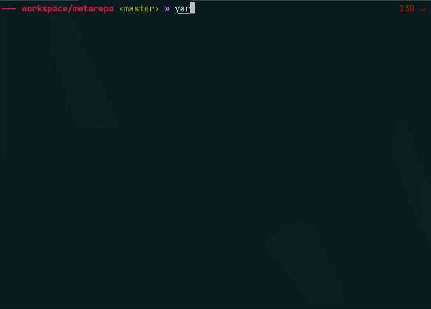

# zsh-npm-scripts-autocomplete
This plugin shows autocomplete suggestions for `npm` scripts from `package.json` at current working directory.
Works with `npm`, `yarn` and `pnpm`.



## Installation
### oh-my-zsh

#### Step 1
Clone this repository to your oh-my-zsh plugins folder  
(by default `~/.oh-my-zsh/custom/plugins`):
```shell
$ git clone \
  git@github.com:grigorii-zander/zsh-npm-scripts-autocomplete.git \
  ~/.oh-my-zsh/custom/plugins/zsh-npm-scripts-autocomplete
```

#### Step 2
Add plugin to your `.zshrc` config:
```shell
plugins=(
  zsh-npm-scripts-autocomplete
)
```

#### Step 3
Restart your terminal or reload `.zshrc` config with the following command:
```shell
$ source ~/.zshrc
```

#### Step 4 (optional)
Invoke selected script with a single hit of `Enter/Return`.
```shell
zmodload -i zsh/complist
bindkey -M menuselect '^M' .accept-line
```
https://superuser.com/questions/1498187/zsh-select-menu-auto-completion-with-single-enter-return-press
